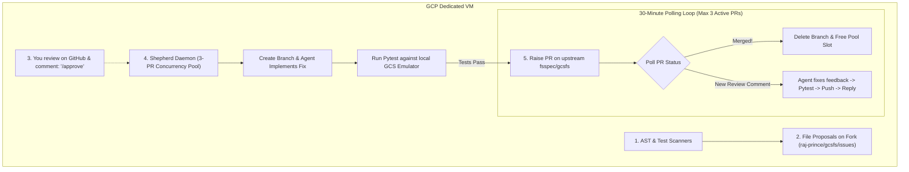

# gcsfs-agent-ops

An autonomous, out-of-tree AI maintenance system and PR shepherd for [`fsspec/gcsfs`](https://github.com/fsspec/gcsfs).

`gcsfs-agent-ops` acts as a dedicated sentry running on a GCP VM. It deterministically scans `gcsfs` for code defects, creates rich proposals for human triage, implements verified fixes with the `gcsfs-expert` agent, and shepherds pull requests until they are merged upstream.

---

## Architecture & Workflow



---

## Key Features

1. **Zero Upstream Repo Clutter (Out-of-Tree)**:
   * The `fsspec/gcsfs` repository remains 100% clean. All scanning engines, agent skills, and state tracking live in this standalone ops repository.
2. **Executive-Ready Proposals for Fast Triage**:
   * Proposed issues are filed on your fork ([`raj-prince/gcsfs/issues`](https://github.com/raj-prince/gcsfs/issues)) with an executive summary, real-world production risk, code snippets with line numbers, and proposed solutions.
3. **100% Web UI Approval Gate**:
   * No CLI required to give the go-ahead. Simply open the proposal on GitHub (desktop or mobile) and comment **`/approve`**.
4. **Autonomous 3-PR Concurrency Pool**:
   * Maintains up to **3 active PRs** at any time. When a PR is merged upstream, the slot is immediately freed for the next approved issue.
5. **Continuous 30-Minute Feedback Shepherd**:
   * The daemon checks open PRs every 30 minutes. If human reviewers or review bots (like `gemini-code-assist`) request changes, the agent applies the fix, verifies with `pytest`, pushes the update, and replies to the review thread.

---

## Repository Structure

```text
gcsfs-agent-ops/
├── README.md                      # Architecture and operational guide
├── config.yaml                    # Concurrency limits, poll intervals, and emulator settings
├── requirements.txt               # Dependencies
├── .gitignore                     # Ignores temp files, logs, and venvs
│
├── skills/
│   ├── gcsfs-expert/
│   │   └── SKILL.md               # Domain rules (fsspec contracts, GCS API, HNS, async tasks)
│   ├── coding-standards/
│   │   └── SKILL.md               # Python best practices (async, error handling, SOLID, performance)
│   └── testing/
│       └── SKILL.md               # Testing best practices (mock autospec, parametrization, fixtures)
│
├── scanners/
│   ├── ast_auditor.py             # AST scanner for fire-and-forget tasks, silent exceptions, etc.
│   └── test_auditor.py            # AST scanner for tests (mock autospec, loops in tests)
│
├── scripts/
│   ├── file_proposals.py          # Files rich, actionable proposals on your fork
│   ├── autonomous_sentry.py       # Single-shot autonomous fix and PR creator
│   ├── shepherd_daemon.py         # 24/7 background daemon (3-PR pool + review responder)
│   └── gcsfs-shepherd.service     # Systemd unit file for 24/7 background execution
│
└── state/
    └── active_prs.json            # Persistent tracking of active PRs and comment timestamps
```

---

## Prerequisites

* **Python 3.10+**
* **GitHub CLI (`gh`)**: Authenticated with your GitHub account:
  ```bash
  gh auth login
  ```
* **Antigravity CLI (`agy`)** or Google Cloud ADC / `GEMINI_API_KEY`:
  ```bash
  agy --version
  ```
* **Local GCS Emulator** (for offline testing):
  ```bash
  docker run -d -p 4443:4443 --name gcs_emulator fsouza/fake-gcs-server:latest -scheme http -public-host 0.0.0.0:4443
  ```

---

## Quickstart

### 1. Install Dependencies
```bash
pip install -r requirements.txt
```

### 2. File Candidate Proposals on Your Fork
Scans `gcsfs` and opens the top candidate issues as proposals on your fork:
```bash
python3 scripts/file_proposals.py \
  --repo ~/c2dev/gcsfs \
  --fork-slug raj-prince/gcsfs \
  --max-proposals 3
```
Proposals will appear on your GitHub fork: `https://github.com/raj-prince/gcsfs/issues`.

### 3. Review & Approve via GitHub Web UI
1. Navigate to your fork's issues tab: [`github.com/raj-prince/gcsfs/issues`](https://github.com/raj-prince/gcsfs/issues).
2. Review the code snippet and production risk assessment.
3. Reply with **`/approve`** in the comment box.

### 4. Run the Autonomous Shepherd Daemon
The daemon monitors your approvals, implements the fixes, runs `pytest`, submits the PRs to `fsspec/gcsfs`, and polls every 30 minutes for comments:

```bash
python3 scripts/shepherd_daemon.py \
  --repo ~/c2dev/gcsfs \
  --upstream fsspec/gcsfs \
  --fork raj-prince/gcsfs \
  --max-prs 3 \
  --poll-interval 1800
```

---

## Running 24/7 in Background on GCP VM (`systemd`)

To run the shepherd daemon continuously in the background on your VM:

1. **Install the service**:
   ```bash
   sudo cp scripts/gcsfs-shepherd.service /etc/systemd/system/
   sudo systemctl daemon-reload
   sudo systemctl enable --now gcsfs-shepherd.service
   ```

2. **Check live status**:
   ```bash
   sudo systemctl status gcsfs-shepherd.service
   ```

3. **Follow logs in real time**:
   ```bash
   journalctl -u gcsfs-shepherd.service -f
   ```

---

## Rules Monitored by the Sentry

| Rule | Severity | What it Detects | Why it Matters |
| :--- | :--- | :--- | :--- |
| **`async-create-task`** | `HIGH` | `loop.create_task()` without retained reference | Prevents premature GC and swallowed exceptions |
| **`error-no-silent-exceptions`** | `MEDIUM` | `except ...: pass` | Prevents hidden I/O failures and silent data loss |
| **`error-exception-chaining`** | `LOW` | `raise ...` inside `except` lacking `from e` | Preserves root cause tracebacks in monitoring |
| **`mock-autospec`** | `MEDIUM` | `mock.patch()` without `autospec=True` | Prevents tests from passing falsely on API drift |
| **`struct-no-logic`** | `LOW` | `for`/`while` loops inside test functions | Enforces clean pytest parametrization |
