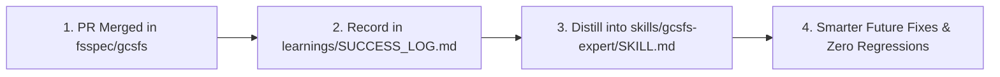

# Autonomous Sentry Learnings & Success Playbooks

This directory preserves institutional knowledge, lessons learned, and winning code patterns from all successful pull requests merged upstream into [`fsspec/gcsfs`](https://github.com/fsspec/gcsfs).

---

## Structure

* **[`SUCCESS_LOG.md`](SUCCESS_LOG.md)**:
  Chronological registry of every merged PR, detailing the problem, winning patch, reviewer feedback addressed, and key takeaways.
* **`playbooks/`**:
  Domain-specific recipes synthesized from merged PRs (e.g. event loop handling, retry policies, buffer management).

---

## Feedback Loop: How Learnings Feed Back into Skills

Whenever a PR is merged:
1. **The Shepherd Daemon** detects the merge status and extracts reviewer comments and final diffs.
2. The lesson is logged in `SUCCESS_LOG.md`.
3. Validated patterns are promoted to [`skills/gcsfs-expert/SKILL.md`](../skills/gcsfs-expert/SKILL.md) so subsequent PRs adopt the proven implementation style accepted by maintainers.
